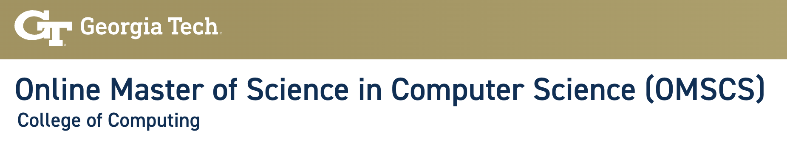

<!--more-->

24 年初打算申请香港的硕士项目，看了港校申请条件，都要求 GPA 3.0 以上，而我的平均学分绩点只有 2.17，于是作罢。后来刷社交平台发现有些学校开设了线上硕士项目，其中一些学校还提供后期转 on compus 的机会（这样可以走 OPT 拿三年实习签证），于是又兴致勃勃的了解了在线硕士项目。

几天看下来，在线硕士项目对我而言大致分了几个方向：

- 想赴美工作
  - 线上转 on campus 留够一年后，走 OPT
  - 全线上拿学位，之后走海外雇员，直接抽 h1b（貌似希望很小）
- 仅拿学位，不打算赴美工作
  - 留在国内工作
  - 拿香港优才到香港工作

我了解的在线硕士项目：

- UT Austin
  - QS 58
  - 不需要推荐信
  - 学费每门课 1000$
- Gatech OMSCS
  - QS 97
  - 学费便宜，大多数学生总费用低于 6500 美元
  - Bar 不高，有 GPA 低于 3.0 申请成功的例子
  - 毕业难度大，放弃率高
  - 需要托福/雅思成绩、三封推荐信
- Arizona State University
  - QS 排名 179
  - 以 3.0 的成绩通过衔接课程，可以满足英语水平和 GPA 的要求
  - 学费 15000 美元
- University of Colorado Boulder
  - QS 264
  - 无申请条件
  - 学费 15750 美元
- Stevens 
  - 全美排名 76，qs 排名 400+
  - 有机构跟这所学校合作，申请会比较方便（小红书、知乎经常能刷到他们发的帖子）
  - 不要求英语成绩（托福、雅思、CET 都不需要）
  - 学费 12000 美元 + 1800 人民币申请费
  - 支持转 on campus，线上线下学费加起来大约 30w 人民币
